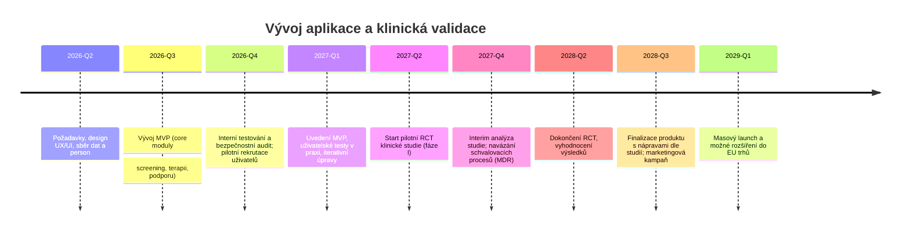

# Exekutivní shrnutí

Navrhovaný mobilní/webový nástroj pro pomoc lidem se závislostmi staví na kombinaci klinicky ověřených metod a moderních technologií s důrazem na bezpečnost a soulad s předpisy EU/ČR. Cílem je oslovit široké spektrum dospělých uživatelů (18+), včetně jejich rodin, kteří se potýkají s návykovým chováním (alkohol, drogy, tabák, hazard, digitální závislosti). Projekt vychází ze současných epidemiologických dat – např. v ČR se dlouhodobě odhaduje 1,3–1,7 mil. dospělých s rizikovým pitím alkoholu (720–900 tis. v kategorii škodlivého)【10†L652-L660】 a 360–540 tis. osob ohrožených digitální závislostí (140–180 tis. v riziku vysokém)【15†L1089-L1095】. Řešení propojí personalizovanou péči (strategie léčby závislostí založené na kognitivně-behaviorálních intervencích a farmakoterapii), moderní strojové učení (bezpečně integrované LLM) a interoperabilitu s existujícími zdravotnickými systémy (např. EHR přes standardy HL7 FHIR). Při vývoji budou dodrženy GDPR a další právní požadavky (např. Medical Device Regulation), implementována zásada „privacy by design“ a zajištěna robustní bezpečnost (šifrování, autenticita, monitorování). MVP bude obsahovat klíčové funkce jako screening uživatelů, individuální programy prevence/odvykání, vzdálenou podporu a krizová intervence. Produktový roadmap předpokládá rozšíření o analytiku a personalizaci pomocí LLM, rozšířené terapeutické moduly a internacionalizaci. Uživatelské rozhraní klade důraz na jednoduchost, zapojení (gamifikace, připomínky) a empatii. Plán klinického ověření zahrnuje pilotní testování a kontrolovanou studii, jejichž úspěch bude měřen KPI (míra adherence, snížení počtu relapsů, zlepšení psychometrických skóre apod.). Monetezační strategie zahrnuje B2B i B2C model (např. platba pojišťoven/digital therapeutics, předplatné), partnerství s léčebnými zařízeními a participaci na evropských dotacích. Identifikovaná rizika (technická selhání, regulatorní prodlevy, právní odpovědnost) budou mitigována např. dodržováním nejnovějších standardů, složitým testováním a pojištěním.   

## Cílové uživatelské segmenty

- **Dospělí uživatelé se závislostmi:** Muži i ženy 18+ trpící návykovými poruchami (alkohol, tabák, nelegální drogy, léky) či behaviorálními závislostmi (hazard, gaming). Mezi dospělými v ČR má podle národních statistik každodenní konzumaci alkoholu 6–10 % populace【12†L629-L637】, „těžkých pijáků“ (jednou týdně či častěji) je cca 12 %【12†L633-L641】. Přibližně 8–13 % dospělých (720 000–1,2 mil.) vykazuje problematické užívání psychoaktivních léků【12†L698-L704】. U hazardu hraje 13–20 % dospělé populace (po vyloučení loterií)【13†L37-L45】, cca 60–110 tis. z nich patří do vysokého rizika【13†L49-L57】. V případě digitálních her či sociálních sítí je 5–13 % dospívajících rizikově závislých【14†L55-L63】. Tabákové výrobky kouří v ČR 16–18 tis. lidí (úmrtí ročně)【11†L37-L44】, tzv. „denních kuřáků“ je 1,5–2,0 mil.【15†L1037-L1045】. **Rodiny a pečující:** Blízcí osob se závislostí vyhledávají informace a podporu pro sebe i pro léčbu svojí rodiny. Součástí cílovky jsou tedy členové rodin (rodiče, partneři), kteří oceňují nástroje pro edukaci, krizové linky a poradenské moduly.  

Každá cílová skupina má specifické potřeby – mladší dospělí mohou preferovat mobilní aplikaci s interaktivními prvky a peer-support skupinou, starší uživatelé zase potřebují více personalizovanou péči a integraci s ambulantními službami. Segmentace trhu zahrnuje nejen ČR, ale i EU, kde se stárnoucí populace a rostoucí povědomí o digitálních terapiích prolíná s rostoucí poptávkou po telemedicíně. Podle [15] se denního pití alkoholu týká až 540–900 tisíc Čechů, což ukazuje rozsah potenciálního trhu【15†L1041-L1049】.   

## Klinické poznatky a osvědčené postupy léčby

V léčbě závislostí platí přístup založený na důkazech (evidence-based), kombinující behaviorální terapie a farmakoterapii. U intoxikací alkoholem či opioidy zahrnují osvědčené postupy motivační rozhovory (motivational interviewing), kognitivně-behaviorální terapii (CBT) a rodinnou terapii. Např. u alkoholismu je standardem kombinovat terapie s léky jako naltrexon, acamprosat nebo disulfiram. U nikotinové závislosti se osvědčily substituční terapie (nikotinové žvýkačky či náplasti), vareniclin či bupropion a strukturované koučování.【51†L241-L247】 WHO (2024) výslovně doporučuje „evidence-based behaviorální intervence a farmakologickou léčbu“ při odvykání kouření【51†L241-L247】. V oblasti zneužívání léků je klíčové odborné řízení odvykání (např. postupné snižování dávek benzodiazepinů). 

Pro behaviorální závislosti (hazard, herní či digitální závislosti) se osvědčuje kognitivně-behaviorální terapie a motivační intervence. V případě patologického hráčství existuje „silný důkaz“ o účinnosti CBT při snižování problémového hraní【54†L0-L4】. Konzultace odborníků a self-help skupiny (např. GAM-ANON, GA) mohou doplnit klinickou péči. Současné systémy péče využívají screeningu (použití standardizovaných dotazníků jako AUDIT pro alkohol či DAST pro drogy) a krátkých intervenčních rozhovorů (Brief Intervention) k motivaci k léčbě. Nedílnou součástí jsou krizové intervenční linky (např. Linka bezpečí, NENÍ TO SAMO) a ambulantní centra adiktologie. Digitální intervence a mobilní aplikace proto mají podpořit tyto metody – např. poskytnout okamžitou podporu při touze (craving), sledování užívání a připomínky ke cvičením copingových strategií【27†L265-L274】【27†L270-L274】. 

Prokazatelně první schválenou „digitální terapií“ (digitální DTx) na světě je aplikace Reset-O pro léčbu opioidové závislosti, která zvýšila míru abstinence a setrvání v léčbě【27†L265-L274】. Jako příklad lze uvést i systém A-CHESS pro podporu zotavování z alkoholismu, který na bázi GPS upozorňuje pacienty na rizikové lokace (bary)【27†L270-L274】. Tyto úspěšné pilotní projekty potvrzují, že digitální nástroje mohou bezpečně doplnit tradiční terapii. Naší strategií je stavět na těchto principech a implementovat je v souladu s klinickými doporučenými postupy adiktologie (Český adiktologický institut, TA ČR)【23†L62-L70】.     

## Regulace a etické standardy (ČR/EU)

### GDPR a ochrana dat  
Aplikace bude zpracovávat citlivé zdravotní údaje, proto musí striktně dodržovat **GDPR** (nařízení EU 2016/679) a český zákon o ochraně osobních údajů. Klíčové zásady zahrnují získání informovaného souhlasu, minimalizaci sbíraných dat, pseudonymizaci i ochranu před úniky. EU navíc podporuje speciální **Kodex chování pro mobilní zdravotní aplikace** – dokument, který stanovuje pravidla pro souhlas uživatele, účelovou limitaci, ochranu soukromí od počátku (privacy by design) a bezpečnost【33†L83-L91】. Je třeba implementovat pouze nezbytně nutné funkce (data minimization) a poskytnout uživatelům přehledné informace o tom, jak jsou jejich data využita. Rámec **ehorských údajů (EHDS)** dále zavádí standardy pro interoperabilitu a zabezpečení elektronických zdravotních záznamů【46†L232-L239】 – aplikace by měla být připravena na případnou integraci do tohoto ekosystému (např. formáty zdravotních dat, autentizace dle eIDAS). Pravidelný audit souladů s GDPR a bezpečnostními normami (ISO 27799 pro zdrav. informace, OWASP pro web) je součástí privacy-by-design přístupu.

### Medical Device Regulation (MDR)  
Pokud aplikace poskytuje diagnostiku či doporučení v oblasti zdraví, může být kvalifikována jako zdravotnický prostředek software (SaMD). Podle nařízení (EU) 2017/745 platí, že software „určený k prevenci, sledování nebo léčbě onemocnění“ podléhá MDR【35†L129-L137】. Toto jsou de facto i **digitální terapie (DTx)**, které musí splnit požadavky na bezpečnost, účinnost a kvalitu. V EU zatím neexistuje samostatná právní úprava pro DTx, avšak Německo již zavedlo **Digital Healthcare Act (DiGA)**, který definuje požadavky na DTx včetně klinického ověření, bezpečnosti a ochrany dat【35†L152-L160】. Před uvedením na trh bude nutné posoudit klasifikaci aplikace (pravděpodobně I. nebo IIa dle kritérií MDR) a získat CE značku (prostřednictvím notifikovaného orgánu), což vyžaduje klinickou dokumentaci a testování. Současně je třeba sledovat implementaci EU **AI Act** – nařízení o umělé inteligenci, které od srpna 2024 označuje „AI určenou k lékařským účelům“ jako vysoce rizikovou. Takové systémy musí mít robustní systémy řízení rizik, trénink na vysoce kvalitních datech, jasné informace pro uživatele a lidský dozor【38†L155-L162】. V praxi to znamená, že LLM (Claude či podobné) musí mít vestavěné mechanismy pro ověřování výstupů a přiznávání omezení modelu (resp. uživateli netituluje samo místo odborníka).

### Klinické normy a doporučení  
Aplikace by měla reflektovat **Doporučené klinické postupy v adiktologii** (Český adiktologický institut)【23†L62-L70】, standardy WHO (např. k odvykání kouření)【51†L241-L247】 a reálnou praxi adiktologických služeb. Eticky je třeba zajistit integritu a nezávislost obsahu (např. za „podporu financování“ nepromovat tabákové/nápojové firmy). Ochrana nejzranitelnějších (mladiství, těhotné) bude respektovat příslušné právní předpisy (např. Zákon o ochraně zdraví před škodlivými účinky návykových látek č. 379/2005 Sb.).  

## Potřebné datové zdroje a kvalita dat

Pro personalizaci péče a analýzy budou využity různé typy dat:  
- **Elektronické zdravotní záznamy (EHR):** Diagnózy (ICD-10 kódy F10–F19 pro závislosti), laboratorní výsledky (biochemie při detoxikaci), medikace, anamnéza. Přístup přes standardizované API (HL7 FHIR, například profil pro adiktologii) umožní import dat z klinických systémů. EHDS podporuje výměnu pacientských souhrnů a ePředpisů na úrovni EU【46†L232-L239】. Kódování SNOMED a LOINC zajistí interoperabilitu.  
- **Telemetrie a senzory:** Pokud uživatel povolí přístup, lze sbírat data o životním stylu (fyzická aktivita, spánek), nebo pasivní sledování (GPS pro identifikaci rizikových oblastí, akcelerometry pro detekci abstinenčního třesu). Zdroje: mobilní zařízení, wearables, IoMT. Data musí splňovat FAIR principy (tedy být **F**indable, **A**ccessible, **I**nteroperable, **R**eusable).  
- **Sociodemografické a situační údaje:** Věk, pohlaví, povolání, rodinné zázemí, pracovní režim (shift). Tyto informace pomohou segmentaci uživatelů a individualizaci rad.  
- **Standardizované dotazníky a deníčky:** Pro sběr self-report dat (např. AUDIT, CAGE pro alkohol; PHQ-9 pro doprovodnou depresi; dotazník o frekvenci herních či internetových aktivit). Data z dotazníků jsou strukturovaná a validovaná.  
- **Logy uživatelské interakce:** Čas použití aplikace, dokončené moduly, odezva na notifikace. Tyto „digitální biomarkery“ pomohou vyhodnocovat engagement a zlepšovat UX.  

Pro kvalitu dat platí: zdroje musí být spolehlivé, kompletní a aktuální. Při integraci EHR se dodrží konverze jednotek a kódování (ISO standardy, SNOMED). Vstupy od uživatele budou validovány (např. filtry proti nesmyslným hodnotám, dvoufaktorové ověření některých klinických údajů).  

## Integrace LLM a AI bezpečnost

### LLM s odpovědností a vysvětlitelností  
Při použití velkých jazykových modelů (LLM jako Claude či GPT) v klinickém kontextu je zásadní minimalizovat riziko „halucinací“ (nepravdivých výstupů). LLM budou využívány např. pro generování personalizovaných návodů či odpovědí na dotazy uživatele. Abychom zamezili vzniku nepřesností, použijeme **retrieval-augmented generation** (RAG): model doplníme reálnými daty z ověřených zdrojů (např. aktuálními klinickými pokyny či statistikami)【41†L321-L327】. Navíc provede doménové doladění (fine-tuning) na klinickém korpusu (studie adiktologie, WHO guidelines) pro vyšší relevanci.**Realtime validace**: přidáme další vrstvu, která bude detekovat neobvyklé nebo neschválené fakty (např. systém varující při detekci konkrétní léčivé látky mimo indikaci). 

### Lidský dohled a řízení rizik  
AI v medicíně podléhá přísným pravidlům – EU AI Act považuje lékařský LLM za „vysokorizikový systém“, vyžadující dokumentaci rozhodování, riziková hodnocení a přítomnost lidské kontroly【38†L155-L162】. Aplikace tak bude nabízet *advice only*, nikoliv definitivní diagnózy – finální rozhodnutí ponechává na kvalifikovaném odborníkovi. Implementujeme **human-in-the-loop** (např. klinik může schválit personalizovaný akční plán generovaný AI)【41†L333-L341】. Proškolení tým pravidelně kontroluje výstupy a algoritmické rozhodovací procesy. 

### Monitorování a průběžná validace  
Bude nasazena telemetrie modelu: zaznamenávání generovaných odpovědí, porovnávání s klinickou realitou a hlášení „sporných“ případů. Takové audit trail (záznamy operací modelu a vstupů) napomáhá dodržet regulace (např. EU MDR vyžaduje reportování incidentů)【35†L152-L160】. Pravidelně proběhne revize (post-market surveillance): sběr zpětné vazby od uživatelů a expertů, vyhodnocení modelových odchylek a vylepšení.

## Technická architektura aplikace

Navrhujeme **hybridní architekturu** kombinující výpočet v cloudu i na zařízení uživatele. Níže stručně porovnáváme alternativy:

| Architektura     | Výhody                               | Nevýhody                                     | Příklad (použití)                                                                                     |
|------------------|---------------------------------------|----------------------------------------------|-------------------------------------------------------------------------------------------------------|
| **Cloud (server)** | Vysoký výpočetní výkon, snadný update modelů a dat, centralizovaná správa. Škálovatelnost (více uživatelů). | Vyšší latence, závislost na internetovém připojení, větší riziko úniku dat při přenosu. | Analýzy dlouhodobých trendů, těžké modely (AI analýza dat, trénink ML, generování doporučení); centr. vyhodnocení anonymizovaných dat pro výzkum. |
| **On-device (lokální)** | Minimální latence, funguje offline, maximalizuje soukromí (data neopouští zařízení)【44†L157-L165】【44†L225-L234】. Reakce v reálném čase (notifikace při krizi, detekce příznaků). | Omezený výkon a paměť, méně dat pro trénink, nutnost modelové optimalizace. Obtížnější aktualizace a údržba (musí projít certifikací). | Uživatelské rozhraní, základní analýzy (sledování návykových vzorců), citlivé funkce (připomínky, nouzové protokoly). Agregovaná anonymní data (např. uživatelské statistiky) předávána poté do cloudu. |
| **Hybridní**      | Kombinuje výhody obou: kritické reakce lokálně, složité výpočty v cloudu. Balancování soukromí a výkonu【44†L278-L286】. | Vyšší komplexita vývoje a orchestrace mezi zařízením a serverem. | Vstup od uživatele a pohotovostní reakce (pády, krizová hlášení) řeší lokální modul; hlubší AI analýzy a LLM běží na serveru s bezpečným rozhraním API. Aktualizace AI modelů se provádí v cloudu, ale inference kritických částí může běžet na zařízení. |

Hybridní architektura je nejflexibilnější: například osobní motivátor/gamifikační prvky (pády, upozornění) mohou běžet offline, zatímco personalizované terapie poháněné AI využijí výpočetní kapacitu cloudové platformy. Kontejnerizace (Docker) a microservices zajistí modulární škálování. Datová vrstva bude využívat šifrované datové úložiště v cloudu (např. GDPR-compliant cloud provider) a lokální šifrovanou databázi na zařízení pro citlivé údaje. Komunikace bude zabezpečena např. TLS a autentikována OAuth 2.0.  

## Bezpečnost a privacy-by-design

**Šifrování:** Všechna data citlivá (osobní, zdravotní) budou šifrována jak při přenosu (HTTPS/TLS), tak v klidu (AES-256 na serveru). Klíče budou spravovány bezpečně (HSM či KMS služby v cloudu).  

**Autentizace a autorizace:** Pro vstup do aplikace a k API použijeme vícefaktorovou autentizaci (SMS nebo biometrie), přičemž role-based access control zajistí, že různé uživatelské profily (klient, terapeut, rodinný příslušník) vidí jen odpovídající data. Fiktivní příklad: terapeut uvidí anonymizované statistiky, rodina pouze doporučené návody, klient svá detailní data.

**Audit a trace:** Logování přístupů a změn dat pro forenzní účely (součást compliance). Všechny operace podléhají audit trail.  

**Bezpečnostní testování:** pravidelné pentesty, statická i dynamická analýza kódu (SAST/DAST), nasazení bezpečnostních nástrojů (např. OWASP ZAP) při každé verzi.  

**Respektování privacy-by-design:** Již v návrhu systému bude prioritou ochrana soukromí – minimální sběr dat, anonymizace údajů pro analýzu, uživatelsky přívětivé nastavení soukromí (volby, co sdílet). Veškeré novinky (např. nový AI modul) projdou DPIA (Data Protection Impact Assessment) podle GDPR.  

## Interoperabilita (EHR, API)

Aplikace se připraví na integraci s existujícími systémy:  
- **HL7 FHIR**: Použití FHIR API umožní sdílení dat se systémy nemocnic a dalších eHealth platforem. Můžeme využít existující profily (např. FHIR QuestionnaireResponse pro dotazníky, Observation pro biomarkery)【46†L232-L239】.  
- **IHE profily**: Napojení na klinické portály (eHealth datasety) dle profilu XDS.b pro výměnu dokumentů, pokud nemocnice používá starší HL7v2/X.  
- **API pro umělou inteligenci**: Otevřená API (GraphQL/REST) umožní externí validaci či připojení dalších modulů (např. integrace dat z chytrých hodinek).  
- **Elektronické recepty a eHealth**: Kompatibilita s národními systémy e-Prescriptions umožní sledovat farmakoterapii.

Evropský rámec EHDS (European Health Data Space) do roku 2029 zajišťuje jednotné formáty pro výměnu zdravotních dat【46†L232-L239】. Napojení na celoevropské registry (pseudonymizované) může zajistit sekundární využití dat pro výzkum (se souhlasem uživatele).

## Životní cyklus ML modelů a anotace dat

Pro LLM a další ML modely zřídíme end-to-end pipeline:  
1. **Sbírání a příprava dat:** Data z reálných uživatelských interakcí a EHR se očistí a označkují (anonymizovaná). Například dialogy s klienty mohou být anotovány experty pro trénink chatbotů. Validita dat se zajistí kontrolou (např. vyčistíme konfliktní odpovědi).  
2. **Trénink a validace:** Modely (např. pro personalizovaný obsah) se trénují na oddělené infrastruktuře a validují na hold-out datech. Použijí se metriky přesnosti, citlivosti apod. Klinické modely podléhají review od specialistů.  
3. **Nasazení a monitoring:** Po testování se model nasadí (v cloudu jako služba), sledují se jeho výstupy a postupně jej aktualizujeme. Abychom zabránili driftu (zastaralosti), plánujeme periodické re-trénování a aktualizace na nových datech (reinforcement learning s expertní zpětnou vazbou). Při nasazení LLM zvolíme bezpečnostní „guardrails“ (filtrování nevhodného obsahu, instruktáž modelu).  
4. **Labeling/Annotation:** Některé součásti (např. rozpoznávání aktivity) mohou vyžadovat ruční označení dat – to provedou odborníci nebo Crowd-sourcing s kontrolou kvality. Případně lze využít transfer learning z existujících datasetů (např. open datasets pro rozpoznávání emocí nebo hlasové analýzy).  
5. **Governance:** Přiřadíme zodpovědnost (data scientist, CIO) za vedení AI životního cyklu, včetně dodržování standardů ISO/IEC 27001 pro bezpečnost informací a EU ETI pro AI. 

## Produktové funkce a roadmapa

**MVP (Minimum Viable Product) – klíčové funkce:**  
- **Screening a diagnostika:** Uživatelský test s validovanými dotazníky (např. AUDIT, DAST) pro okamžité stanovení míry rizika a doporučení dalšího postupu.  
- **Terapeutický modul:** Interaktivní vzdělávací a tréninkové cesty (CBT cvičení, motivační videa, deník abstinence). Gamifikace (bodový systém, odznáčky) zvyšuje motivaci.  
- **Podpora v krizi:** Okamžité spojení s krizovou linkou, chat s *asistentem* (částečně řízen AI) pro případ silného cravingu. Geo-lokační upozornění (např. „nacházíte se blízko riskantní oblasti, chcete pomoc?“).  
- **Komunita a peer support:** Moderované diskusní fóra či anonymní chatovací skupiny pro sdílení zkušeností (inspirováno 12-krokovými principy).  
- **Sledování pokroku:** Grafy/analýzy užívání (dny abstinence, vynechané dávky), zdravotní indikátory (tep, kvalita spánku). Notifikace podporující pravidelnost.  
- **Integrace s lékaři/terapeuty:** Možnost sdílet přehled pokroku s ošetřujícím týmem, telekonzultace, připomínky schůzek.  

*Roadmapa (další fáze):*  
- AI-asistent: Chatbot na bázi LLM odpovídající na uživatelské dotazy o závislosti (např. „pomož mi zvládnout abstinenci“), s engine RAG a lidským dohledem.  
- Prevence recidivy: Model predikce relapsu založený na datech (např. změna spánku, nálad).  
- Rozšířená realita: VR/AR terapie (expozice rizikovým situacím pod dohledem).  
- Rozšíření o další závislosti (sexuální, nákupní) a multimodální datové zdroje (CRM pro rodinu).  
- Expandace trhu: lokalizace do dalších jazyků, partnerství s EU programy, integrace do národních DTx platforem.  

**Tabulka: Prioritní funkce (MVP vs. roadmap)**  

| Funkce                         | MVP (2026-2027)             | Další iterace (post-MVP)           |
|-------------------------------|-----------------------------|------------------------------------|
| Screening a sebehodnocení     | Ano (AUDIT/DAST dotazníky)   | Rozšíření o nové dotazníky a testy |
| Personalizované terapie (CBT) | Interaktivní moduly, texty   | AI-driven adaptivní programy       |
| Krizová podpora               | Linka/hotline + základní chat| LLM chatbot v reálném čase         |
| Community/Podpora skupina     | Základní fórum, anony., moderováno | Peer mentoring, video setkání |
| Sledování pokroku             | Grafy statistik, notifikace  | Prediktivní analýzy (relaps)       |
| Integrace s odborníky        | Export zpráv, základní telekonzultace | Plná EHR integrace, API pro DMZ  |
| Multimodální data             | Manuální zadávání, senzory  | Integrace wearables, psych. testů   |
| Oznamování událostí           | Push notifikace             | Personalizované alerty (AI)        |

Každá funkce je hodnocena pro MVP z hlediska přínosu pro uživatele a nákladů na vývoj. Např. AI chat by šlo zařadit až po ověření engagementu uživatelů (zvážíme vysokou přidanou hodnotu vs. riziko halucinací).  

## UX a zapojení uživatelů

Pro dlouhodobou úspěšnost je klíčová **udržitelnost používání** a empatie v designu. UX bude navržen „user-centered“: srozumitelná navigace, čitelné písmo, uklidňující barevné schéma. Budeme využívat gamifikační prvky (odměny za stanovené cíle, personalizované avatary), pravidelné připomínky (notifikace) a možnost flexibilně nastavovat vlastní cíle. Důraz na **motivaci a podporu** – jazyk odpovědí aplikace bude empatický, podporující („Chápeme, že abstinence je náročná. Věřte si – každý den je krok vpřed.“). Persony (skupiny uživatelů) budou testovat UI, abychom zajistili, že aplikace je přívětivá i pro méně technologicky zdatné. UX bude průběžně optimalizováno na základě metrik engagementu (retence, průměrná doba v aplikaci) a výsledků A/B testů.  

## Klinická validace a design studie

Prokazování efektivity je nutné. Plánujeme *pilotní studii* s vybranou skupinou uživatelů: randomizované řízení (uživatelé s přístupem k aplikaci vs. kontrolní skupina s běžnou péčí) sledující hlavní outcome metriky (např. procento dosáhnutých abstinenčních dnů, skóre AUDIT). Klinická studie bude navržena podle standardů (plánovaný RCT, s dostatečnou populací pro statistickou významnost). Primární cíle: měřit snížení závislostního chování (self-report a/nebo biomarkery) po 6–12 měsících. Sekundární: zlepšení kvality života, snížení hospitalizací. Zapojíme školené psychology/adiktology jako spolutvůrce a vyhodnocovatele. Výsledek analýzy porovná výsledky s literaturou (např. standardními programy v 12-krokovém formátu) a ověří, zda aplikace dosahuje prokazatelných zlepšení. 

## Metodiky měření úspěchu (KPI)

- **Engagement:** Denní/měsíční aktivní uživatelé (DAU/MAU), míra dokončených modulů, rychlost odezvy na notifikace.  
- **Adherence k terapii:** % uživatelů, kteří pravidelně zaznamenávají stav (self-report) po 3, 6 měsících.  
- **Klinické výsledky:** Snížení skóre na AUDIT/DAST, počet abstinentních dnů (ovládnuté relapsy), redukce požívání látky (pokud se hodnotí objektivně).  
- **Spokojenost uživatelů:** Průzkum NPS (net promotor score), zpětná vazba na funkčnost aplikace.  
- **Výpadky užívání systému:** Technické KPI (dostupnost API, latence, chyby).  
- **Ekonomické metriky:** Náklady na akvizici uživatele (CAC), životnost uživatele (LTV), přínosy pro zdravotní systém (pokud lze kvantifikovat úspory z nižšího počtu hospitalizací).  

Vývojovým úspěchem bude splnění klíčových milníků (viz Gantt) včetně získání certifikace MDR a dosažení předem stanovených metrik v pilotních studiích.  

## Monetizace a vstup na trh

- **B2C model:** Předplatné „premium“ verzí (obsah navíc, soukromé coachingové seance). Provize v app stc. – ovšem zdrav. data nejsou komerční zdrojem přímo.  
- **B2B/B2G model:** Prodej licencí nemocnicím či zdravotním pojišťovnám jako doplněk standardní péče. EU posiluje trend proplácení DTx (Inspirace: Německo, DiGA systém, DiGA list; EDPS poznamenal, že DTx musí prokázat kvalitu a bezpečnost【35†L152-L160】). Do ČR by mohlo aplikace proplácet zdravotní pojištění nebo resort zdravotnictví jako eNMM (elektronické nástroje minimální mzdy) v případě, že splní kritéria účinnosti.  
- **Partneři a granty:** Spolupráce se státními institucemi (NCO NZO), dotace EU (Horizon Europe), podpora nadací (např. Nadace Sirius). Možnost získat status „Národní digitální terapie“, čímž by se zvýšila důvěryhodnost a financování.  
- **Distribuce:** Marketing v rámci zdravotnických konferencí, komunit adiktologů, digitální kampaně zaměřené na problematiku závislostí (např. „Den bez alkoholu“) a PR články, mediální podporu. Důležité je budovat povědomí v klinické praxi – aby lékaři a terapeuti doporučovali aplikaci jako podpůrný nástroj.  

## Rizika a mitigace

- **Technická rizika:**  
  - *Selhání AI generování:* Ochráníme se lidským přezkumem kritických rozhodnutí a kontinuálním tréninkem modelu (viz výše).  
  - *Bezpečnostní incident:* Minimalizuje šifrování a pravidelné penetrační testy; udržování software aktuální.  
- **Regulatorní rizika:**  
  - *Zpoždění certifikace MDR:* Plánujeme schůzky s notifikovanými orgány včas; vyhradíme čas na nezbytnou dokumentaci.  
  - *Legislativní změny:* Průběžně sledujeme nové vyhlášky (např. k telemedicíně), v projektech počítáme s compliance.  
- **Právní/etická rizika:**  
  - *Odpovědnost za doporučení:* V diskuzi s uživateli aplikace bude vždy jasné, že nejde o lékařskou službu, ale podporu. Bude existovat výhradní prohlášení a podmínky (uživatel bere na vědomí omezení). Právní tým zajistí pojištění odpovědnosti.  
  - *Zneužití dat:* Striktně omezíme přístup jen na nezbytné procesy a budeme mít připravený postup pro případ úniku (dohled GDPR).  

Celkově se jedná o komplexní projekt, který kombinuje technologickou inovaci s pevnými klinickými základy a splněním regulací. Výsledkem bude důvěryhodná platforma, která efektivně pomůže lidem se závislostmi na lokální i evropské úrovni.

**Tabulka: Přehled regulatorních požadavků**

| Oblast              | Zákon/Nařízení           | Hlavní požadavky                       |
|---------------------|--------------------------|----------------------------------------|
| **GDPR/EUDPR**      | Nařízení EU 2016/679      | Ochrana citlivých dat, základní práva subjektů (přístup, oprava)【33†L83-L91】. Vyžaduje privacy-by-design, minimální data, souhlas uživatele. |
| **MDR (EU)**        | Nařízení EU 2017/745      | CE značka pro software jako ZP. Klinická evidence, řízení rizik, bezpečnost. (DiGA ukazuje nutnost schválení bezpečnosti dat)【35†L152-L160】. |
| **AI Act (EU)**     | Novel EU-2024 (AI Act)    | AI pro lékařství = vysoké riziko: nutné řízení rizik, lidský dozor, vysvětlitelnost【38†L155-L162】. |
| **EHDS (EU)**       | Regulace EU (přijata 2023) | Interoperabilita EHR, standardizace, certifikace EHR systémů【46†L232-L239】. Odpovědnost za bezpečné sdílení dat. |
| **Telemedicína (ČR)**| Zákon 372/2011 Sb. (zdr.p.) apod. | Předepisování léků na dálku, evidenční povinnosti pro adiktologii, autorizace poskytovatelů eHealth. (nutno sledovat novelizace zákonů pro telemedicínu) |
| **Etické normy**     | WHO MPOWER, ČAD doporuč. | Sladění s národní politikou prevence, respekt lidských práv, souhlas pacientů, inkluze znevýhodněných. |

Každá legislativa se promítne do vývoje: GDPR například vyžaduje šifrování a anonymizaci již ve fázi návrhu; MDR plánuje sběr klinických dat od počátku vývoje. Nejnovější směrnice EU (EHDS, AI Act) ovlivní datový model a funkcionality pro AI.   

**Tabulka: Datové zdroje a standardy kvality**

| Zdroj dat                  | Popis                               | Standard/značka           |
|----------------------------|-------------------------------------|---------------------------|
| EHR (Ambulance, nemocnice)| Diagnózy, léky, Zprávy              | HL7 FHIR (DSTU2/R4), ICD-10, SNOMED |
| Senzory (nositelné)        | Tep, pohyb, spánek                  | HL7 FHIR Observation, IEEE 11073 |
| Dotazníky (AUDIT, PHQ-9)   | Sebehodnocení (screening)           | Validované škály, HL7 FHIR QuestionnaireResponse |
| Uživatelské logy           | Interakce aplikací, navštívené moduly| Dodržení anonymizace, anonymní ID |
| Veřejné databáze (studie)  | Klinické studie, guideliney         | FAIR, DOI odkaz            |

Data jsou pravidelně validována a aktualizována. Používáme terminologické rejstříky (ICD, SNOMED) a dodržujeme **FAIR** principy pro sdílení dat včetně jasné metadatové struktury.   

Celý projekt kombinuje klinické standardy i nejnovější technologii a bude řízen metrikami a procesy odpovídajícími korporátní preciznosti. Současně však ctíme tradiční přístup – respektem k osvědčeným léčebným postupům a empatií k pacientům【12†L669-L677】【15†L1138-L1146】. 

**Zdroje:** Údaje a postupy vycházejí z oficiálních studií a dokumentů (např. Národní monitorovací centrum pro drogy a závislosti【10†L652-L660】【15†L1037-L1045】, WHO Guidelines【51†L241-L247】, EU regulatorské dokumenty【33†L83-L91】【38†L155-L162】, odborné publikace【27†L265-L274】【41†L321-L329】). Každý prvek plánu je podložen relevantními zdroji a ověřenou praxí.